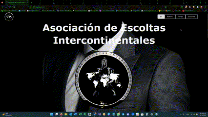
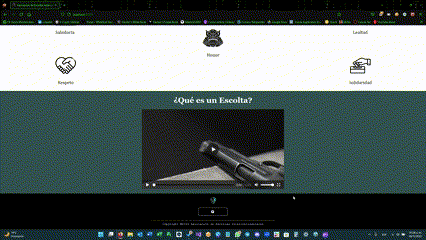

<div id="top"></div>

<!-- LOGO DEL PROYECTO -->

<br />
<div align="center">
  <a href="https://github.com/github_username/repo_name">
    
  </a>

<h3 align="center">Asociación de Escoltas Intercontinentales</h3>

  <p align="center">
    Página web para difusión y ventas en línea desarrollada con React.js
    <br />
    <a href="https://github.com/V-Crypt/AEI-Website.git">
    <br />
    <strong>Explore los documentos »</strong></a>
  </p>
</div>

<!-- SOBRE EL PROYECTO -->

## Sobre el proyecto

Sitio web de la "Asociación de Escoltas Intercontinentales" para hacer de su presencia en el mundo digital, así como para vender sus productos y servicios de seguridad en línea.

### Tecnologías implementadas

- [React.js](https://reactjs.org)
- [Semantic UI React](https://react.semantic-ui.com)
- [PayPal API](https://developer.paypal.com)
- [NodeJS](https://nodejs.org)
- [npm](https://www.npmjs.com)

<!-- EMPECEMOS -->

## Empecemos

Para poner en marcha una copia local, siga esta sencilla guía.

### Pre-requisitos

- [NodeJS](https://nodejs.org)

### Instalación

1. Clona el repositorio con el siguiente comando:
   ```
   git clone https://github.com/V-Crypt/AEI-Website.git
   ```

2. Instala los paquetes de NPM con el siguiente comando:
   ```
   npm install
   ```

3. Asegurate de instalar también las dependencias de "Semantic UI React", "React Player", "React Slick" y "React PayPal", pues también se usaron para el desarrollo del sitio web, con los siguientes comandos:
   ```
   npm install --save semantic-ui-react
   npm install --save semantic-ui-css
   ```
   ```
   npm install react-player --save
   ```
   ```
   npm install react-slick --save
   npm install slick-carousel --save
   ```
   ```
   npm install @paypal/react-paypal-js
   ```

### Ejecución

- Accede de primera instancia a la carpeta ejecutable con el siguiente comando: 
  ```
  cd asocescoltasinterco-website
  ```

- Ejecuta el programa con el siguiente comando: 
  ```
  npm start
  ```

<!-- EJEMPLOS DE USOS -->

## Usabilidad

### Menú

<p align="center">
  
</p>

### Footer

<p align="center">
  
</p>

### Inicio

<p align="center">
  
</p>

### Galeria

<p align="center">
  
</p>

### Tienda

<p align="center">
  
</p>

### Contacto

<p align="center">
  
</p>

## Contacto

**Líder del Proyecto:** 
  - Jesús Monterrubio  

**Correo:** 
  - js_monterrubio.ec@outlook.com

**Otro medio de contacto:**
  - [LinkedIn](https://www.linkedin.com/in/jesus-monterrubio)

<p align="right">
  (<a href="#top">Regresar arriba</a>)
</p>
